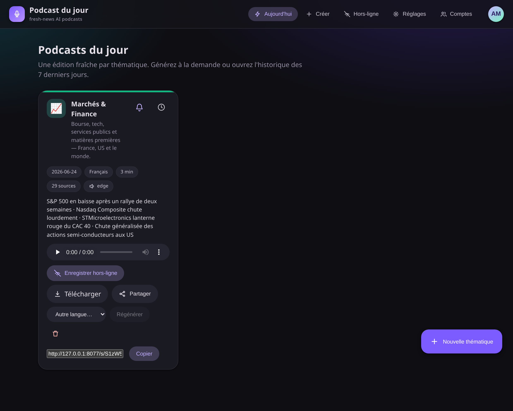
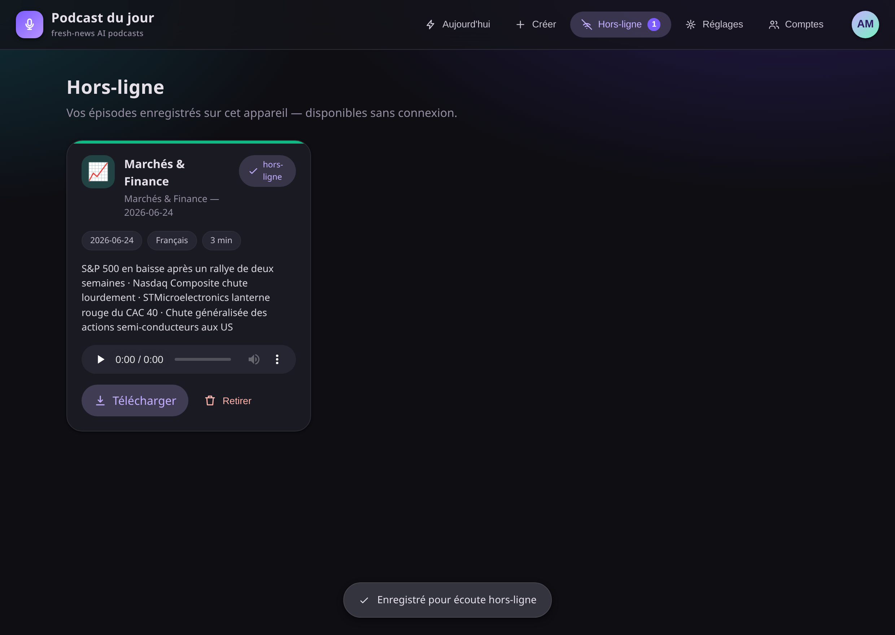

<div align="center">


# Podcast du jour

**Daily, fresh-news AI podcasts — one Material-design platform.**

Research today's news per theme → write a two-host script with an LLM → voice it →
serve it with accounts, roles, email subscriptions and full offline playback.

🌐 **[Project site & screenshots →](https://lp177.github.io/podcaster/)** · 📦 **[Source on GitHub →](https://github.com/lp177/podcaster)**

</div>

<p align="center">
  
  
</p>

---

## ✨ Features

- **Fresh sources every run** — Gemini with Google-Search grounding pulls the last 48 h,
  falling back to the theme's RSS feeds, then a plain-LLM summary. A per-theme memory file
  skips stories already covered.
- **Provider fallback** — LLM: Gemini → OpenAI → Anthropic → Ollama. TTS: Gemini → OpenAI →
  **Edge (free, always available)**. Bring any one LLM key and audio works for free.
- **Material Design UI** — tonal surfaces, paper elevation and real touch ripples on every
  control, built as a no-build Vue app with custom Material components.
- **Accounts & roles** — cookie-session auth with three roles (**admin / publisher /
  reader**). Publishing is gated; the first account created becomes the admin.
- **Email subscriptions** — readers subscribe to subjects and get an email with a private
  listen link whenever a new episode is released (best-effort SMTP, disabled until configured).
- **Offline PWA** — installable app; tap *“Save offline”* and a service worker caches the
  audio so saved episodes play with no connection.
- **Scheduling** — run themes daily or weekly via a single hourly cron entry, or the bundled
  `scheduler` container.
- **Multilingual** — French, English, Spanish, German, Italian, with native voices and
  one-click regeneration into another language.
- **Private share links** — mint an unguessable `/s/<key>` link to listen with no login.

---

## 🚀 Quick start

You only need **one LLM key** to start (e.g. `GEMINI_API_KEY`). Audio is free via Edge TTS.

### Docker / Podman (recommended)

```bash
cp .env.example .env          # add at least GEMINI_API_KEY
docker compose up -d          # or: podman-compose up -d
# open http://127.0.0.1:8077  — the first account you create becomes admin
```

[docker-compose.yml](docker-compose.yml) builds the [Containerfile](Containerfile) and also
starts a `scheduler` service that fires due schedules every hour — no host cron needed.
`.env` and `data/` are bind-mounted, never baked into the image.

Prefer to build the image directly?

```bash
podman build -t podcast-du-jour -f Containerfile .          # or: docker build -f Containerfile .
podman run -d --name pdj -p 127.0.0.1:8077:8077 \
  --env-file .env -v ./data:/app/data podcast-du-jour
```

The image pins exact, known-good versions from [requirements.lock.txt](requirements.lock.txt)
(the full working venv), so the container matches development. It uses the full `python:3.13`
base because a few pinned deps build from source on Python 3.13. No browser is installed —
research uses Gemini + RSS, not headless scraping.

### Local (Python 3.13)

```bash
python -m venv .venv && source .venv/bin/activate
pip install -r requirements.txt

cp .env.example .env          # add a key
python server.py              # http://127.0.0.1:8077
```

> `ffmpeg` must be on your PATH (the container image installs it for you).

---

## 🔑 Configuration

All secrets live in `.env` (gitignored — **never commit it**). Copy
[.env.example](.env.example) and fill in what you have; API keys are also editable from the
web UI → **Réglages** (admin only).

| Variable | Purpose |
| --- | --- |
| `GEMINI_API_KEY` | Default provider — research, scripting, optional TTS |
| `OPENAI_API_KEY` | Fallback scripting / TTS |
| `ANTHROPIC_API_KEY` | Fallback scripting |
| `OLLAMA_API_BASE` | Local / OpenAI-compatible endpoint |
| `ELEVENLABS_API_KEY` | Optional premium voices |
| `SMTP_HOST` / `SMTP_PORT` / `SMTP_USER` / `SMTP_PASSWORD` / `SMTP_FROM` | Email notifications (optional) |
| `APP_BASE_URL` | Public URL used in notification & share links |

---

## 👥 Roles

| Role | Can do |
| --- | --- |
| **admin** | Everything — users & roles, API keys, SMTP, scheduler. *First registered account.* |
| **publisher** | Create themes, generate & schedule episodes. |
| **reader** | *Default.* Listen, save offline, subscribe to subjects, get email notifications. |

---

## 🖥️ Command line

```bash
python generate.py markets-finance                 # default language & length
python generate.py markets-finance --lang en --minutes 12
python generate.py --list                          # list themes
python themes/markets_finance.py --minutes 8       # each theme is a standalone script
```

## ⏰ Scheduling (host cron)

```bash
python scheduler.py install-cron     # add the one hourly crontab line
python scheduler.py tick             # what the cron runs each hour
python scheduler.py loop 3600        # foreground loop (used by the container)
python scheduler.py list             # show schedules
```

## ➕ Add a built-in theme

Drop a module in [themes/](themes/) exposing a `THEME = Theme(...)`; it is auto-discovered by
`generate.py`, the scheduler and the web UI. See [themes/markets_finance.py](themes/markets_finance.py).

---

## 🧩 How it works

```
research (fresh news) → transcript (LLM) → audio (TTS) → catalog + memory → email subscribers
```

- Generating a theme removes that theme's episodes older than 7 days (retention).
- All state is plain JSON + MP3 files under `data/` (gitignored).

## 📁 Project layout

```
podkit/      shared library (research, providers, generator, accounts, mailer, schedule …)
themes/      one module per built-in subject
web/         Material-design PWA (index.html, app.js, styles.css, sw.js, manifest)
docs/        GitHub Pages site + screenshots
server.py    FastAPI app (auth, episodes, scheduling, admin)
scheduler.py cron / loop runner
generate.py  CLI
```

---

Built on the [podcastfy](https://github.com/souzatharsis/podcastfy) engine.

_Last updated: 2026-06-24._
